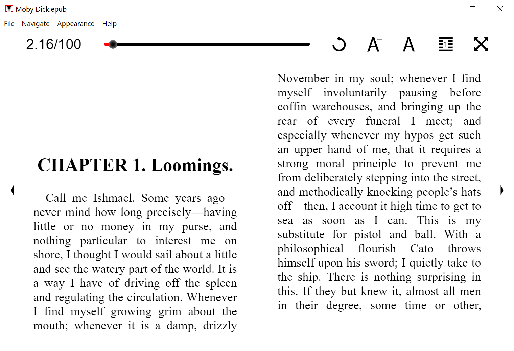

# rbook

A simple electron app for reading epub files



# Features

- Clean interface
- Themes (Light, Dark, Sepia)
- Fullscreen mode
- Page slider
- Increase/Decrease font size
- Swipe to change page
- Back button with history
- Single/Double page view
- Hotkeys

# Getting Started

```javascript
cd app
npm install
npm start
```

# Build
```
cd app
npm run dist
```
The installer will be found in `app/build`

# To-Do

- [ ] Item
